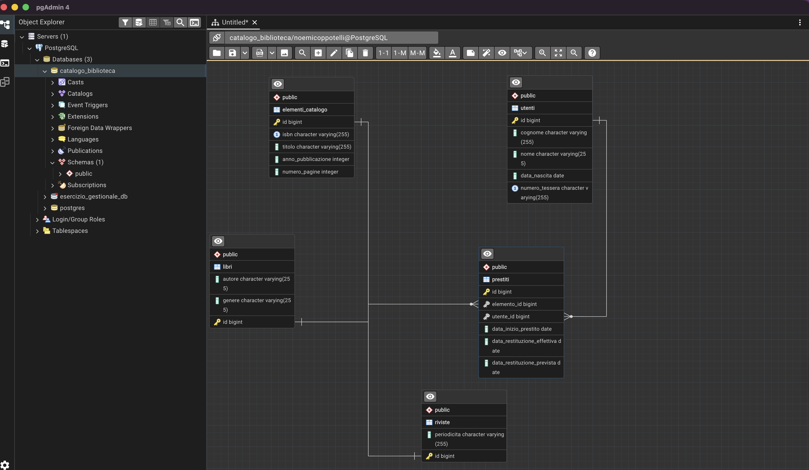

# Catalogo Bibliotecario - Project 3

Progetto Java con JPA e PostgreSQL per la gestione di un catalogo bibliotecario con prestiti.

## Schema ER

## Scelte progettuali

### ElementoCatalogo come superentità
Ho modellato `ElementoCatalogo` come classe astratta padre di `Libro` e `Rivista` perché sia i libri che le riviste condividono attributi comuni (isbn, titolo, anno di pubblicazione, numero di pagine). Ho usato la strategia `JOINED` perché ogni tipo ha anche attributi propri: i libri hanno autore e genere, le riviste hanno la periodicità. In questo modo ogni tabella contiene solo i dati che le appartengono.

### ISBN e numero tessera come UNIQUE e non come PK
L'isbn di un libro e il numero di tessera di un utente sono univoci per natura, non ci saranno mai due libri con lo stesso isbn né due tessere con lo stesso numero. Ho scelto però di non usarli come chiave primaria perché la PK deve essere stabile e generata dal sistema, mentre isbn e numero tessera sono codici "del mondo reale" che in linea di principio potrebbero essere corretti o riassegnati.

### Data restituzione prevista calcolata automaticamente
La data di restituzione prevista viene calcolata automaticamente nel costruttore di `Prestito` come data di inizio + 30 giorni, in modo da non doverla inserire manualmente ogni volta e ridurre il rischio di errori.

### Gestione prestiti
Un utente può avere più prestiti contemporaneamente (su elementi diversi), e uno stesso elemento può essere stato prestato più volte nel tempo (ma non contemporaneamente). La relazione è quindi `Utente 1:N Prestito` e `ElementoCatalogo 1:N Prestito`.
